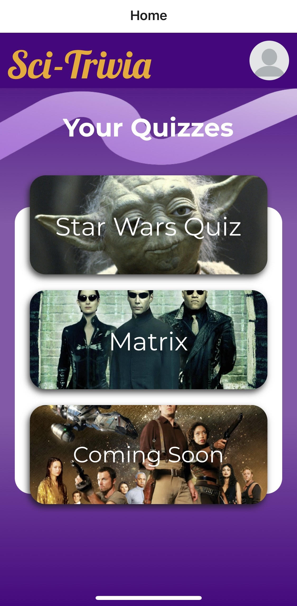

# Sci-Trivia App

Welcome to Sci-Trivia! This is a science fiction themed quiz app developed by 3 School of Code graduates branching out to learn new technologies which, in this case, include React Native and TypeScript. 


## Installation

The project was built using [expo-cli](https://expo.dev/tools#cli). You will need to install it in your system.

Clone the project, cd in to the folder and run:

```bash
  git clone https://github.com/anastasia-starostina/React_Native_SciFi_App
  cd React_Native_SciFi_App
  npm install
``` 

To start the app run:

```bash
  npm start
  # or
  expo start
```

Windows users run:

```bash
  expo start --tunnel
```
## ATTENTION 🔺

We changed node modules in our project.
See Optimisation section for more details.

## Features

- The choice of 2 Sci-Fi quizzes.
- Score Tracker.
- Users can use the device camera to take a picture and preview it on the profile page.
- Swippable quiz screen.
- Template to put your own quiz data in.

## Tech Stack

**Client:** 
- ReactNative
- TypeScript
- Expo

## Screenshots


## Demo

Click on the photo below to see the demo of the app:

<a href="https://www.youtube.com/watch?v=laizIkWFgTc" target="_blank">
 
</a>

## Project Management

We kept track of the tasks using Trello ticketing system and followed Agile Scrum Methodology. We finished each day with a retro & took notes about what went well, what didn't go well and what we learned on that day.

## UI Design

When we did our research on Quiz User Interfaces, we noticed how prevalent shades of purple were for association with wisdow and mystery.
[Follow this link to find out more about color psychology](https://www.colorpsychology.org/
). 

We used yellow as a complementory colour for texts/highlights as according to some research it stimluates mental activity.

## Color Reference

| Color         | Hex                                                              |
| ------------- | ---------------------------------------------------------------- |
| Main Colour |  #4b0082 |
| Highlight Colour |  #EFA80C |
| Text Colour |  #ffffff |
| Shadow Colour |  #000000 |
| Gradient Colour |  #4b0082a3 |


## Key Takeaways
- Learned how React Native works & its syntax.
- Significance of having the right node modules in React Native due to its minimal & unopinionated design.
- Stuck to DRY principles by modularising our codebase into Components.
- Effectively used TypeScript throughout the project and gained experience that highlighted the importance of planning out TypeScript interfaces and types.
- Integration of Expo Camera for taking a user avatar picture and previewing it. 

## Roadmap

- More Quizzes
- Build a backend and a database
- Persistent profile image
- Saving a picture that saves on an internal phone system
- Having access to internal camera system
- Multiplayer (Leader boards with friends)
- Authorisation

## Acknowledgements

- [Expo Google Fonts](https://www.npmjs.com/package/@expo-google-fonts/dev)
- [Expo Camera](https://www.npmjs.com/package/expo-camera)
- [Expo Linear Gradient](https://www.npmjs.com/package/expo-linear-gradient)
- [Expo Status Base](https://www.npmjs.com/package/expo-status-bar)
- [React Native Radio Buttons](https://www.npmjs.com/package/react-native-radio-buttons-group)

## Authors

- [@anastasia](https://www.github.com/anastasia-starostina)
- [@christophe](https://www.github.com/St0neofFr33dom)
- [@carloseam](https://www.github.com/carloseam)


## Optimization

In  `node modules/react-native-radio-buttons-group/lib/RadioButton.tsx` we integrated Expo Linear Gradient Component within this file. 

Replace the code in this file with:

```bash
import React from 'react';
import { PixelRatio, Pressable, StyleSheet, Text, View} from 'react-native';
import { LinearGradient } from "expo-linear-gradient";
import { RadioButtonProps } from './types';

export default function RadioButton({
  borderColor,
  color = '#444',
  containerStyle,
  description,
  descriptionStyle,
  disabled = false,
  id,
  label,
  labelStyle,
  layout = 'row',
  onPress,
  selected = false,
  size = 24,
}: RadioButtonProps) {
  const borderWidth = PixelRatio.roundToNearestPixel(size * 0.1);
  const sizeHalf = PixelRatio.roundToNearestPixel(size * 0.5);
  const sizeFull = PixelRatio.roundToNearestPixel(size);

  let orientation: any = { flexDirection: 'row' };
  let margin: any = { marginLeft: 10 };

  if (layout === 'column') {
    orientation = { alignItems: 'center' };
    margin = { marginTop: 10 };
  }

  function handlePress() {
    if (disabled) {
      return null;
    }
    if (onPress) {
      onPress(id);
    }
  }

  return (
    <>
      <Pressable
        onPress={handlePress}
        style={[
          styles.container,
          orientation,
          { opacity: disabled ? 0.2 : 1 },
          containerStyle,
        ]}>
          <LinearGradient  colors={[
        "rgba(75,0,130,1)",
        "rgba(75,0,130,0.64)",
      ]} style = {styles.radioButtons}>
        <View
          style={[
            styles.border,
            {
              borderColor: borderColor || color,
              borderWidth,
              width: sizeFull,
              height: sizeFull,
              borderRadius: sizeHalf,
            },
          ]}>
          {selected && (
            <View
              style={{
                backgroundColor: color,
                width: sizeHalf,
                height: sizeHalf,
                borderRadius: sizeHalf,
              }}
            />
          )}
        </View>
        {Boolean(label) && <Text style={[margin, labelStyle]}>{label}</Text>}
        </LinearGradient>
      </Pressable>
      {Boolean(description) && <Text style={[margin, descriptionStyle]}>{description}</Text>}
    </>
  );
}

const styles = StyleSheet.create({
  container: {
    alignItems: 'center',
    marginHorizontal: 10,
    marginVertical: 5,
  },
  border: {
    justifyContent: 'center',
    alignItems: 'center',
  },
  radioButtons: {
    height: 50,
    width: 300,
    borderRadius: 20,
    paddingLeft: 10,
    display: 'flex',
    flexDirection: 'row',
    alignItems: 'center',
  }
});

```